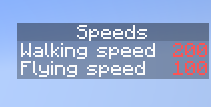

# SpeedCheck
A simple plugin made to show and modify the walking and flying speed in mc servers

## Preview

## Compatibility
The plugin requires Java 21 and Minecraft 1.21 or newer*.

## Commands
- /togglescoreboard
    Aliases:
    - /togglesb
    - /sbtoggle
- /toggledebug
    Aliases:
    - /toggledbg
    - /togglesbdbg
    - /togglespeeddbg
- /getcurrentspeed
    Aliases:
    - /getspeed
    - /gcs
- /setcurrentspeed
    Aliases:
    - /setspeed
    - /scs

## Permissions
- speedscoreboard.toggledebug
- speedscoreboard.getcurrentspeed
- speedscoreboard.setcurrentspeed

*It can run on older versions, however the Java requirement is valid.